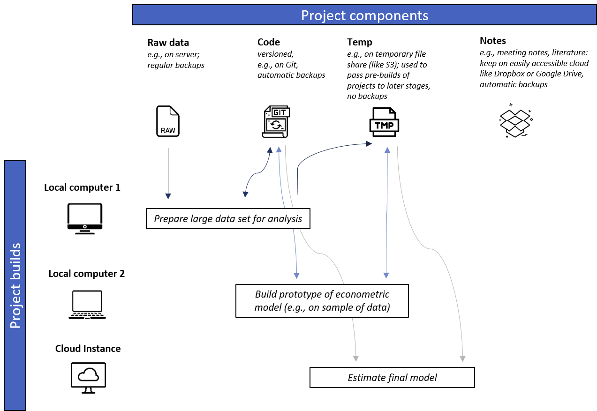

# Pipelines and Project Components

## Overview

It is useful to break down a project into its most basic parts, which we call
**pipeline** and **components**.

- A pipeline refers to the **steps that are necessary to build a project** (e.g., prepare dataset, run model, produce tables and figures), and
- Components refer to **a project's most nuclear building blocks** (e.g., data, source code, and generated temporary and/or output files).

## Project Pipelines

In a research project, one typically has a number of tasks to accomplish, such as preparing the data, analyzing the data, writing the paper and producing a set of slides.
**This is what we call a "project pipeline".**

A typically pipeline for an academic paper may look like this:

!!! example "Typical pipeline for an academic paper"
    - Prepare dataset for analysis
    - Run model on dataset
    - Produce tables and figures for paper

Over time, your pipeline will grow increasingly complex. For example, the pipeline
above recently "matured" into this one:

!!! example "More complex pipeline for an academic paper"
    - Download public datasets from the U.N. (to be used for some control variables)
    - Have an RA code some auxiliary variables - files to be delivered in Excel
    - Merge your main data set with control variables from previous steps; generate
    to "derivative" data sets - one at the monthly level, and one at the weekly level.
    - Estimate models on both data sets
    - Systematically compare both models
    - Choose best model, and produce tables and figures for a paper.

Of course, you can even come up with pipelines that are even more complex -
not because we love complexity, but because we love clarity.

The benefits of conceiving your project as a pipeline are straightforward:

- **Write clearer source code:** separate your thousand-line source code into multiple smaller, more accessible components (as defined in your pipeline, like preparing dataset, then running a model, then producing tables and figures).
- **Obtain results faster:** Because your project is separated into different steps,
  you can easily run "later" stages of your project (we call this "downstream"),
  on the basis of *different* input files defined earlier in your project (we call this "upstream").
  You can run later stages in your project (e.g., "analysis") using different
  inputs (e.g., a data set at the monthly level, and at the weekly level) -
  that way, you can rapidly understand how robust your findings are with regard
  to alternative specifications
- **Increase transparency and foster collaboration:** With clearer source code, you automatically allow
  others to more easily understand your code. Also, why not make a co-author
  responsible for prepping that data for you ("upstream" in your pipeline), while you
  concentrate on developing a prototype model (more "downstream" in your pipeline)?

## Project Components

Now that we've covered what a pipeline is, let's draw our attention to project components, which are the most nuclear building blocks of a project.
Suppose you needed to bring structure to [Hannes's chaotic first project](structure_phd_2013.html), then probably you may end up
with the following "components":

1. **raw data**
2. **source code** to execute your pipeline (defined earlier; e.g., preparing data, analyzing it, and producing some
tables or figures), and
3. **generated temp (temporary and output) files** that are the result of executing your source code (e.g., think
  of tables or figures).
4. **notes**: e.g., meeting notes, PDFs of the literature that you've read, etc.

It's useful to think of these components as separate entities of your project, because
their nature *allows* you to apply different data management policies. For example,
we probably all agree it's desirable to "roll back" to previous versions of a project
(e.g., a previous version of a prepped dataset). But - if you work on large datasets,
it may probably be too burdensome to store each and every version of it (e.g., in one
of the projects we've been working on, the prepped data sets were a 500 GB, and
we've created probably close to 50 versions = 25 TB). If you think about this a
bit more, you may actually discover that storing these different data sets is
completely inefficient - as the combination of raw data and *versioned source code*
will be able to "re-cast" any data set version you have ever worked on.

So, here's our advice on how to store each component of your project.
Of course, check with your own institution and their rules on data storage
and management.

!!! tip "Data management policies for project components"
    1. Raw data
        * Store where: On a secure server that project members have access to
        (e.g., could also be a network folder; later, we show to you how to use
        a variety of systems like Amazon S3, Dropbox, or Google Drive to
        "host" your raw data). No time to think about this much? Well, then
        just have your data available locally on your PC, and set yourself a
        reminder to move it to a more secure environment soon.
        * Backup policy: Regular backups (e.g., weekly)
        * Versioning (i.e., being able to roll back to prior versions): not necessary, although
        you need to store different versions of the same data (e.g., a data set delivered in 2012, an updated dataset delivered in 2015) in
        different folders.
    2. Source code
        * Store where: on Git/GitHub - which will allow you to collaborate efficiently on code
        * Backup policy: Inherent (every change can be rolled back - good if you
          want to roll back to previous versions of a model, for example)
        * Versioning: complete versioning
    3. Generated temp (temporary and output) files
        * Store where: only on your local computer.
        * Backup policy: None. These files are entirely produced on the basis of raw data and source code,
        and hence, can always be "reproduced" from 1. and 2. if they get wiped.
    4. Notes
        * Store where: anywhere where it's convenient for you! Think about tools like
        Dropbox or Google Drive, which also offer great features that you may
        enjoy when you work in a team.
        * Backup policy: Automatic backups (standard for these services)
        * Versioning: not necessary (but typically offered for free for 1 month)

## Putting it all together...

It's time to finally build your project! See our overview chart below,
which illustrates how different stages of your pipeline use
different project components.

1. In the first stage of the pipeline, we use a workstation with relatively large memory
(e.g., 64 GB) to download the raw data from our secure server, and run some
code to prepare different versions of the dataset (e.g., the final data, and
dataset only 1% of the size of the full one). We version our code using Git, and
upload the two final datasets to the temporary file exchange.

    !!! tip "The file exchange"
        The fifth project component - we have not mentioned that one before - is
        called **file exchange**. File exchanges are used to easily **"ping-pong" (upload or download)
        generated temporary or output files between different stages of the pipeline**.

        Using a file exchange, a co-author building a prototype model on his
        laptop (see stage 2 of the pipeline) can already work a dataset that another author prepped on a high-performance
        workstation (this part of the pipeline), without having to actually build it him/herself on the laptop.

        We'll explain later how to set up such temporary file services.

2. In the second stage of the pipeline, we have switched to our laptop, and
pull in only the sample data set from the file exchange. That one is only a few
megabytes big, so it's perfect to develop a prototype model and extensively
test it. We pass the model results back to the file exchange so that we can
already generate some tables and figures for stage 4 of the project. Of course,
we're also committing our changes to the model code to Git so that later
pipeline stages can use our updated model code.

3. It's time to estimate our model on the entire dataset! We've launched
a powerful EC2 instance in the Amazon Cloud, cloned our source code using Git,
pulled in that big final dataset from the file exchange, and estimate our model.
We're relieved the model is running in the cloud, as that computer likely will
not restart or crash (unlike our office PC, which may be arbitrarily shut down
by our IT admins... - been there before...).

4. Time to shine! We pull in our final data set from stage 1, and either the
prototype model results (from stage 2) or the final model results (from stage 3)
to produce tables (e.g., descriptive stats, model results) and figures (e.g.,
plotting some data) that will directly feed in our paper our slide deck.

!!! summary

    You've just learnt about two essential ways to look at a project.

    1. The **pipeline** defines the logical steps in which your project
    is built (such as prepping data, analyzing it, and creating tables and figures).
    2. The **components** refer to the most nuclear units in a project - consisting
    of raw data, source code, generated temporary/output files, a file exchange,
    and lastly a collection of notes/other documents.

    The power of setting up your project that way lies in:

      - **full portability**
          - Because of the modular nature of the project, each pipeline
          can essentially be executed on different computing systems. That's super
          handy if you have a powerful workstation in your office (e.g., high RAM to prep
          some large data sets), but would like to work on your laptop while traveling to
          make some progress on your model prototype.
          - Your project may need large computational resources to estimate your model on your final data set -
          so you can easily "port" your entire infrastructure to a high-performance cluster
          (e.g., surfsara in Amsterdam, EC2 at Amazon Web Services, etc.).
      - **reproducibility and transparency**
          - nothing in this project is "manually edited" (e.g., deleting some observations
            in an Excel file) - every bit of your project is documented
            in source code.
          - anybody interested in running your analysis can run your code
          (but tell them to visit our website first!) ;)
          - even *you* will be able to understand your project better,
          e.g., when you continue working on it after a while, like for a revision.
